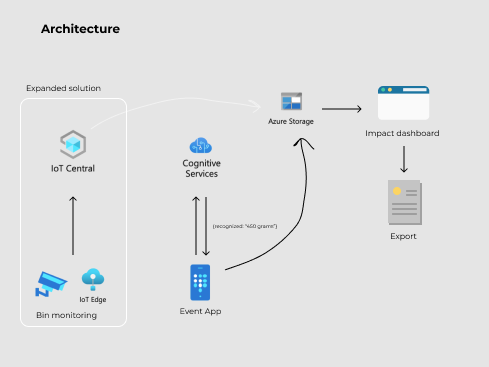
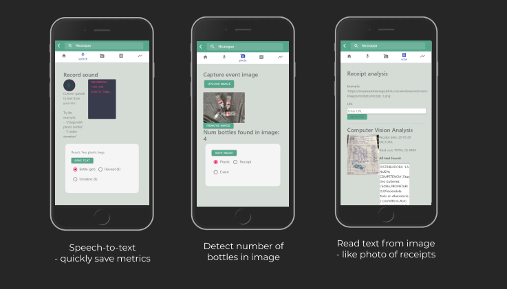

# Eruza 
Eruza -  Waste Automation & Management System is a digital solution that aims to automate the end to end process of plastic bottle collection and impact report generation with  details like event ID, event location, benefited people count, delivered product list, photos of the bills, the digitized content of the bill, photos of the event, financial & funding details, etc

Our mobile web application helps the volunteers to quickly capture image or voice content which is analyzed and transformed into metrics that are essential for generating the impact report. The solution makes it easy to run waste collection efforts, letting organizations focus on the social and environmental impact.

## Repo Details

High level directory structure for this repository:

```bash
├── frontend                  <- A progressive web app, connected with Azure resources via Azure SDK for JavaScrip
├── azure                     <- Azure related code
│   ├── AzureResourceGroup    <- ARM template for the solution in Azure.
│   ├── iotedge               <- IoT Edge project with camera capture module and custom vision module
├── images                    <- Images used in the documentation
```


### Azure Requirements
1. [Azure Account](https://portal.azure.com) 
2. [Custom Vision Service](https://docs.microsoft.com/en-us/azure/cognitive-services/custom-vision-service/)
3. [Optical Character Recognition (OCR)](https://docs.microsoft.com/en-us/azure/cognitive-services/computer-vision/concept-recognizing-text)
4. [Speech API](https://docs.microsoft.com/en-us/azure/cognitive-services/speech-service/index-speech-to-text)
5. [Read API](https://westcentralus.dev.cognitive.microsoft.com/docs/services/computer-vision-v3-1-ga/operations/5d986960601faab4bf452005)
6. [Azure Storage Account](https://docs.microsoft.com/en-us/azure/storage/common/storage-account-overview)
7. [Blob containers](https://docs.microsoft.com/en-us/azure/storage/blobs/)
8. [Storage table](https://docs.microsoft.com/en-us/azure/storage/tables/table-storage-overview)
9. [Azure IoT Edge](https://docs.microsoft.com/en-us/azure/iot-edge/?view=iotedge-2018-06)
10. [Azure IoT Central](https://docs.microsoft.com/en-us/azure/iot-central/)
11. [Azure SDK](https://azure.github.io/azure-sdk-for-js/)
12. [Raspberry Pi](https://www.raspberrypi.org/)

# Technical Overview
We have used the [Custom Vision Service](https://docs.microsoft.com/en-us/azure/cognitive-services/custom-vision-service/) for object detection. Object detection is useful to detect plastic bottles and count them.  Then we have used [Optical Character Recognition (OCR)](https://docs.microsoft.com/en-us/azure/cognitive-services/computer-vision/concept-recognizing-text) for converting the image of the receipt into digital text.  We have created our application as a progressive web app (More details are given below). [Azure Blob container](https://docs.microsoft.com/en-us/azure/storage/blobs/) is used as a database to store the images of plastic bottles, receipts and event images. Storage tables were created to enable storing the event details, stats about collected bottles, product lists, digitized content of the receipt, etc. We also took advantage of [Azure IoT Edge](https://docs.microsoft.com/en-us/azure/iot-edge/?view=iotedge-2018-06), [Azure IoT Central](https://docs.microsoft.com/en-us/azure/iot-central/), and used devices like [Raspberry Pi](https://www.raspberrypi.org/) as well. More detailed content is discussed below.

## Azure Cognitive Services
[Azure Cognitive Services](https://docs.microsoft.com/en-us/azure/cognitive-services/) is a family of cloud-based services that includes REST APIs and Client library SDKs that can embed cognitive intelligence into the application with ease. The categories of cognitive services include vision, speech, language, decision, and search. Thus, They can help the application to see, hear, speak, understand and assess the situation to be decisive, as accurately as possible.

We have relied on one of the core capabilities of Azure Cognitive Service called [Custom Vision Service](https://docs.microsoft.com/en-us/azure/cognitive-services/custom-vision-service/) to build an object detector model. We have also involved other APIs like Speech API to make the process simple.

### Object Detection Model

To utilize the [Custom Vision Service](https://docs.microsoft.com/en-us/azure/cognitive-services/custom-vision-service/), we have created Custom Vision Training and Prediction resources in Azure.

During the project creation, We have chosen Custom Vision Service Resource as the resource group and  Object Detection as the Project type. Once the project is created, we have the collection of images that varies by parameters like size, background, etc ready, thus we added the images to the training images workspace and tagged each one of them appropriately to help the recognition learning of the detector. The process was repeated for the next set of images.

#### Training Details
The current images and their tags are utilized by the detector to create the object detection model that identifies each tagged object as accurately as possible. The training process can be witnessed in the performance tab once the train button is clicked.

#### Evaluation Details
The performance of the model can be calculated after the completion of training.  The Custom Vision Service has calculated the precision, recall, and mean average precision using the images submitted by us. On the left pane of the performance tab, We have set the probability threshold slider as 65 % that acts as the prediction threshold. The Overlap Threshold helps us to set the minimum allowed overlap between the predicted object bounding box and the actual user-entered bounding box.

### Optical Character Recognition
We have utilized the [Optical Character Recognition (OCR)](https://docs.microsoft.com/en-us/azure/cognitive-services/computer-vision/concept-recognizing-text) capabilities of the Computer Vision API to recognize and extract the text from the images of the receipts. In particular, We have used the Computer Vision [Read API](https://westcentralus.dev.cognitive.microsoft.com/docs/services/computer-vision-v3-1-ga/operations/5d986960601faab4bf452005) of the OCR technology to extract the printed text. The Read API gave us the capability to extract text from multiple languages,  handwritten texts, and other contents like digits & currency symbols with ease. Even, We are able to handle the scenarios involving text-heavy images, multi-page pdf documents, images containing both printed & handwritten text with ease by utilizing the capabilities of [Read API](https://westcentralus.dev.cognitive.microsoft.com/docs/services/computer-vision-v3-1-ga/operations/5d986960601faab4bf452005).

To build the model, we have loaded the input of a receipt and made a post request to [Read API](https://westcentralus.dev.cognitive.microsoft.com/docs/services/computer-vision-v3-1-ga/operations/5d986960601faab4bf452005). This call returns a response with the header field Operation-Location. We have extracted the operation ID from the Operation-Location URL. Then we made a get request to the [Computer Vision API](https://westcentralus.dev.cognitive.microsoft.com/docs/services/computer-vision-v3-1-ga/operations/5d9869604be85dee480c8750) with the operation ID. This get request gave us a JSON response with the status field. We executed this get operation multiple times until we get the succeeded status. Once the status is with succeeded value, We found that the JSON response holds the extracted content from the image. We also can see that the extracted text line contains all extracted words with their coordinates and confidential scores.

## Web App (Volunteer App)
We have built our web app as a progressive web app using React & typescript. We relied on [Azure SDK](https://azure.github.io/azure-sdk-for-js/) for javascript to build our application. A progressive web app stands between mobile websites and mobile apps. It gives a mobile app-like experience to the users still being a website. Users can save the progressive web app on their home screen just like a native app. One big advantage of progressive web app is their platform and device agnosticism. That is, the app can be used seamlessly irrespective of the platform they rely on. You can see more details about the front end [here]( https://github.com/SaraOlsson/eruza-waste-cleanup/tree/main/frontend)

## Azure Storage Account
We have used [Azure Storage Account](https://docs.microsoft.com/en-us/azure/storage/common/storage-account-overview) as our primary storage for our application. Azure Storage Account is the place where Azure Storage data objects are stored. Azure Storage data objects include blobs, queues, tables, files, and disks.  The organization can retrieve the necessary data from this database to create its impact report.

We have used [Blob containers](https://docs.microsoft.com/en-us/azure/storage/blobs/) to store the images required for the project. In our case, we have stored the images of the plastic bottles and the receipts. Later, the organization can retrieve the images for the particular use case, like they can retrieve the images of the receipts for the purpose of the tax claim. We also started a [Storage table](https://docs.microsoft.com/en-us/azure/storage/tables/table-storage-overview) to store the other data like event details, stats about collected bottles, product list, digitized content of the receipt, etc, however some work to connect the data flow is left to future work.

## Azure IoT Edge
[Azure IoT Edge](https://docs.microsoft.com/en-us/azure/iot-edge/?view=iotedge-2018-06) is a fully managed service built on an Azure IoT hub that can deploy cloud intelligence locally on IoT edge devices like Raspberry Pi via Containers. We have used Azure Custom Vision to build a container model that can identify the plastic bottles.

[Azure IoT Edge](https://docs.microsoft.com/en-us/azure/iot-edge/?view=iotedge-2018-06) analyses the data locally and filters them before sending the required data to the cloud. Thus the organization gets the sophistication to focus on business insights rather than spending time on data management. Scaling out is way easy with the presence of IoT Edge. It is just a matter of packaging the business logic into the containers which can be deployed to any device of our choice and monitored from the cloud. Other main advantage of this model is, The reaction to an event can be pretty quick and the possibility for offline operation.

This tech comes in handy to operate in places that have limited internet connections.

## ARM Template

[Infrastructure as code](https://en.wikipedia.org/wiki/Infrastructure_as_code) is the way to automate the deployment. When utilizing this strategy, we usually define the infrastructure & configuration of the project using the code, where you declare the required objects, types, names, and properties in a JSON file format.

[Azure Resource Manager templates (ARM templates)](https://docs.microsoft.com/en-us/azure/azure-resource-manager/templates/overview) are the way to implement infrastructure as code for your Azure solutions. ARM templates use a declarative syntax to get the required inputs from the user, thus enabling the user to redeploy the infrastructure with minimal effort. We have stored the ARM templates to reproduce our infrastructure under the [AzureResourceGroup folder](https://github.com/SaraOlsson/eruza-waste-cleanup/tree/main/azure/AzureResourceGroup) of our Github Repo. With just a click, You can reproduce our infrastructure.

## Benefits

- Plastic bottles collection - Fast & Easy
The proposed automated system automatically recognize and count the number of plastic bottle. Thus stats can be updated in the database with ease.

- Digitization of physical bills
The app has an option to scan the images of the physical bills with a single click and it converts the image into the digital text via image recognition. The system will also store the images of the physical bills in a separate database for later reference (Maybe, Useful for tax claims). Thus transparency can be maintained.

- Easy volunteer addition
The interactive app prototype has a feature where volunteers can be added and notified about the event. Consider a scenario, If 10 people have shown interest in volunteering, their mail IDs can be added to the mobile app. Any delay in the event, any excess food details can be shared with all volunteers with a single click thus they can address the issue by bringing the right people.The contacts of the volunteers will be maintained at the database, thus the NGO can contact/notify them about future events without much difficulties.

- Event Multimedia Database
The app has the option to click pictures/videos during the event. Later, the pictures can be retrieved from the database if required for the impact report

- Voice Support
The volunteer cab update the collected plastic bottle count by just tapping the mic and talking. The Speech API will convert it into the text and store the data in the database

- Easy Impact report Generation
The location, number of benefited people, Pictures of the events, delivered product list , financial and funding details will be attached to the event ID thus much helpful to generate the impact report.

- Schedule maintainence
The calendar feature helps people to track their schedules. Filter feature helps them to filter the events based on the IDs and get all the relevant data with a single click.

## Screenshots

System Architecture  


Screenshots - Web app  


## Enhancements

Future work would be to add incentives for more people to recycle their plastic waste, possibly in a fully automated system:
- People could register in the app before dropping their bottles into an IoT-connected waste bin. Thus, Once they drop the bottles, the number of bottles is auto-calculated and the equivalent reddem points can be attached to the bar code that is tagged with their mobile app. They can scan this bar code in any partnered food stalls all over the country to encash their points for food.
- The bin capacity can be auto monitored using IoT Central and can enable auto notification to the administrator in case of bin overflow 
- The app can also be used for Smart city administration, Marine clean-up, Disaster recovery, etc with slight modifications.


## Demo 
 [Demo](https://youtube.com) 
